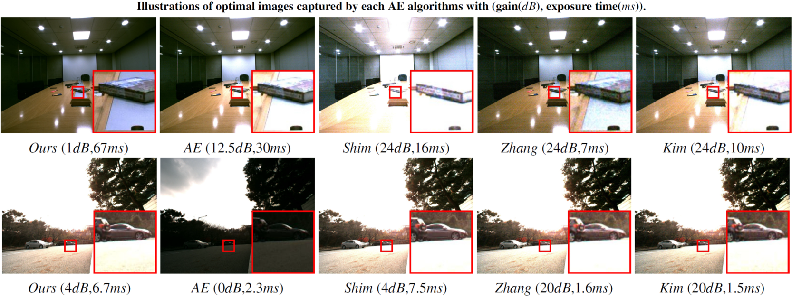
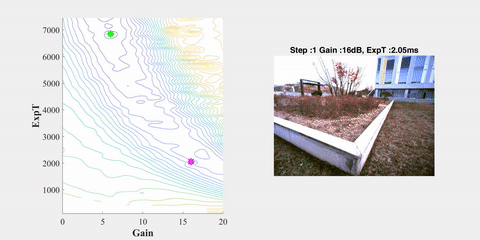
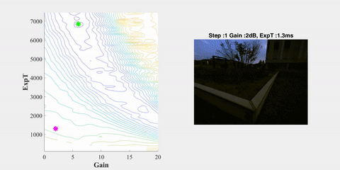
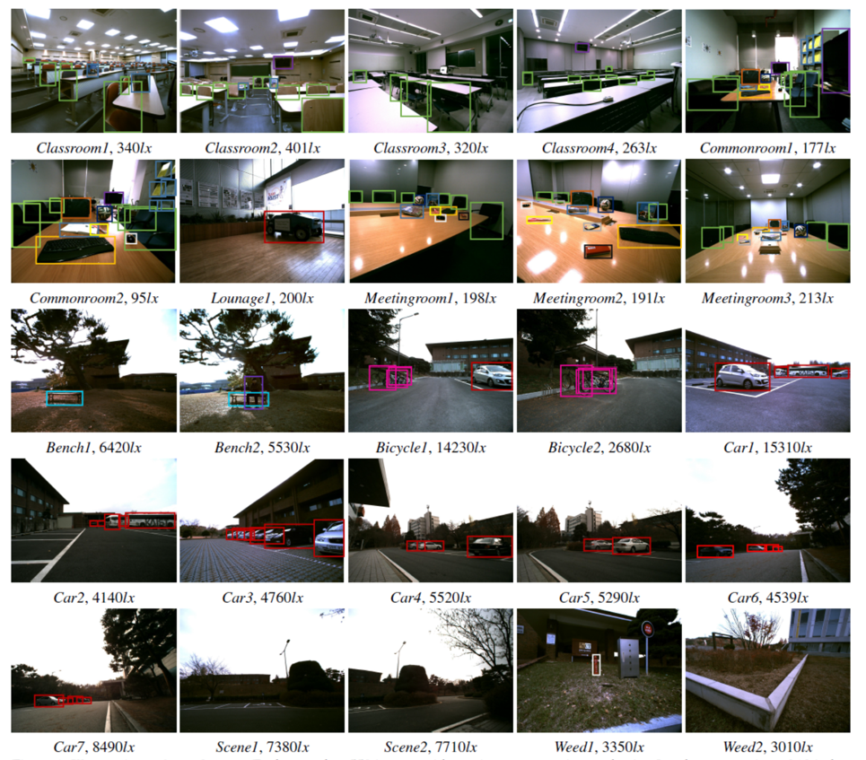

# Camera Exposure Control for Robust Robot Vision with Noise-Aware Image Quality Assessment

In this paper, we propose a noise-aware exposure control algorithm for robust robot vision. Our method aims to capture best-exposed images, which can boost the performance of various computer vision and robotics tasks. Our metric consists of a combination of image gradient, entropy, and noise metrics. The synergy of these measures allows the preservation of sharp edges and rich texture in the image while maintaining a low noise level. 
Using this novel metric, we propose a real-time and fully automatic exposure and gain control technique based on the Nelder-Mead method. 

## Overview

<p align="center">
  
  
</p>

[**[Full paper]**](https://arxiv.org/abs/1907.12646) [**[YouTube]**](https://www.youtube.com/watch?v=9ILFITEwNX0)

## Dataset
<p align="center">
  
</p>

In this paper, we provide a unique dataset developed specifically to compare exposure control algorithms. 
The composition of this dataset is as follows.
- **HW setup:** a stereo camera system with 20 cm baseline acquiring synchronized 1600 x 1200 px images.
- **# of scene:** Total 25 scene (10 indoor, 15 outdoor)
- **# of image:** Each scene consist of 550 x 2 images
  - Outdoor Environment
    - Exposure time  : [0.1 - 7.45 ms] with 0.15 ms interval
    - Gain : [0 - 20]dB with 2dB interval
  - Indoor Environment
    - Exposure time  : [4 - 67 ms] with 3 ms interval
    - Gain : [0 - 24]dB with 1dB interval
- **# of object class:** 13 Object Class 
  - Person, Bicycle, Car, Firehydrant, Backpack, Sports ball, Chair, Mouse, Keyboard, Cellphone, Book, Scissors, and TV.
  - However, some objects appear very rarely, we need to acquire more dataset.
- **Download link:** https://drive.google.com/file/d/1DUeByL_ADzGyRpqc0iXA-DxZwLOd5Q-U/view?usp=sharing 


## Quick Start: Demo Script
### 1. Download the datset
```bash
clone this repositroy
donwload datset from [here](https://drive.google.com/file/d/1DUeByL_ADzGyRpqc0iXA-DxZwLOd5Q-U/view?usp=sharing)
unzip "DataSet_AE.zip"
```

### 2. Run MetricEvaluation.m
```bash
run "Run_MetricEvaluation.m"
```
Then, this matlab code create and save a landscape of the proposed image quaility assessment metric for each dataset.

Note that, we have cleaned and optimized the code for better readability. However, the result could be slightly different from the result reported in the paper.

The original results, including related works, can be available [here](https://drive.google.com/open?id=1arj7DjiY6gHdqbuLdzC1N4B2EANXYYTv).

If you want use original results, unzip this file into "Result_Exp" folder.

### 3. Run NMbasedControl.m
```bash
run "NMbasedControl.m"
```
This matlab code runs the paper version of the Nelder-Mead optimization based control algorithm for each dataset.


### 4. Run FeatureMatching.m
```bash
run "FeatureMatching.m"
```
This matlab code conducts a experiment about a feature extraction & matching.
To do this experiment, you need to install OpenCV on matlab by following [this link](https://github.com/kyamagu/mexopencv/wiki/Installation-%28Windows%2C-MATLAB%2C-OpenCV-3%29).

## Citation
Please cite the following paper if you use our work or parts of this code in your own work.
```
@article{shin2019camera,
  title={Camera exposure control for robust robot vision with noise-aware image quality assessment},
  author={Shin, Ukcheol and Park, Jinsun and Shim, Gyumin and Rameau, Francois and Kweon, In So},
  journal={arXiv preprint arXiv:1907.12646},
  year={2019}
}
```
